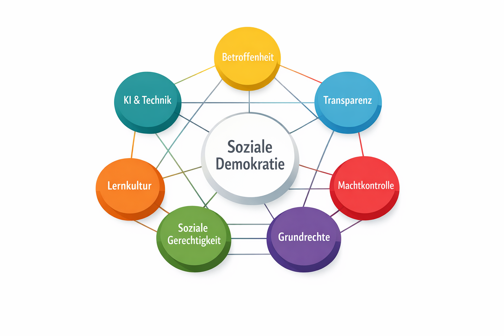

# 12.1 Die sieben Transformationsregeln der Sozialen Demokratie

_Arbeitsdokument – Entwurf_

- **Autor:** Robert Alexander Massinger
- **Ort & Datum:** München, Deutschland – 2025-11-22

## Zweck dieses Anhangs

Wie lässt sich eine bestehende Struktur – ein Staat, ein Unternehmen, eine Stadtverwaltung, ein Verband, eine Plattform oder auch ein Netzwerk von KI‑Systemen – so umbauen, dass sie **wirklich sozial und demokratisch** wird?

**„Sozial“** heißt hier: Die Schwächeren werden geschützt, Lasten und Chancen werden fair verteilt, und eine verlässliche Grundsicherung ist gewährleistet.

**„Demokratisch“** heißt hier: Macht ist gebunden an Beteiligung, öffentliche Kontrolle und unveräußerliche Rechte – nicht an Stimmungen, Zufälle oder reine Effizienz.

Die folgenden Regeln sind so formuliert, dass sie in sehr unterschiedlichen Kontexten anwendbar sind. Sie dienen als Referenzrahmen: zur kritischen Analyse bestehender Systeme – und als Kompass für ihre Transformation.

### Die sieben grundlegenden Elemente sozialer Demokratie

_Abbildung 12.1: Die sieben grundlegenden Elemente sozialer Demokratie bilden ein geschlossenes Netz. Die Begriffe in der Grafik entsprechen den sieben Regeln, die im Folgenden erläutert werden._

## 1) Die sieben Transformationsregeln (1.1–1.8)

### 1.1 Prinzip der Betroffenheit – „Nichts über uns ohne uns“

**Kernaussage:** Niemand soll dauerhaft über andere entscheiden, ohne sie einzubeziehen.

Soziale Demokratie beginnt mit einer einfachen Einsicht: Wer von einer Entscheidung wesentlich betroffen ist, muss eine Stimme haben. Das umfasst drei Ebenen:

- **Informiert sein:** Betroffene wissen, dass eine Entscheidung ansteht – und worum es geht.
- **Gehört werden:** Sie können ihre Perspektive einbringen.
- **Mitentscheiden:** direkt oder über gewählte/vertretende Rollen.

„Betroffenheit“ ist kein reines Bauchgefühl, sondern sollte klar beschrieben werden: Wie wirkt eine Entscheidung auf Einkommen, Rechte, Lebensumfeld, digitale Infrastruktur oder Sicherheit? Wer trägt die Konsequenzen – heute, morgen, in zehn Jahren?

Je demokratischer eine Struktur, desto weniger gibt es „unsichtbar Betroffene“: Gruppen, die mit Folgen leben müssen, ohne irgendwo aufzutauchen – etwa künftige Generationen, Nachbargemeinden oder Menschen ohne Lobby.

### 1.2 Transparenz- und Begründungspflicht – Macht muss sichtbar sein

**Kernaussage:** Macht, die weder sichtbar noch begründet ist, entzieht sich der Demokratie.

Demokratische Legitimität hängt nicht nur davon ab, **wer** entscheidet, sondern auch davon, **wie** entschieden wird. Deshalb gilt:

- Regeln, Zuständigkeiten und Entscheidungswege sind offen dokumentiert.
- Wichtige Entscheidungen werden begründet: Ziele, Alternativen, Trade-offs, Datengrundlage.
- Es ist nachvollziehbar, wer was wann entschieden hat.

Wo intelligente Systeme – einschließlich KI – Entscheidungen vorbereiten oder treffen, müssen sie prüfbar sein: Ziele, Lernprozesse und Grenzen müssen untersuchbar bleiben. Eine Black‑Box, die über viele herrscht, ist mit sozialer Demokratie unvereinbar.

Prüffrage: Könnte eine durchschnittlich informierte Person mit etwas Zeit verstehen, wer was entschieden hat, warum – und auf welcher Grundlage?

### 1.3 Macht begrenzen, rotieren und kontrollieren – gegen Machtstau

**Kernaussage:** Macht ohne Grenzen wird früher oder später missbraucht – auch mit guten Absichten.

Demokratische Strukturen akzeptieren die Fehlbarkeit von Menschen und Organisationen. Die Antwort ist nicht Generalmisstrauen, sondern ein intelligentes System von Beschränkungen:

- **Funktionstrennung:** Entscheiden, Umsetzen und Kontrollieren liegen nicht dauerhaft in denselben Händen.
- **Zeitbegrenzungen:** Führungsrollen und Mandate sind befristet, Rotation ist vorgesehen.
- **Unabhängige Aufsicht:** Es gibt Instanzen mit Zugriffsrechten und echten Sanktionsmöglichkeiten.
- **Whistleblower-Schutz:** Wer Missstände meldet, riskiert nicht die eigene Existenz.

Das gilt ebenso für KI: Es darf keine zentrale, unangreifbare Super‑Instanz geben, die alles steuert. Stattdessen braucht es mehrere unabhängige Prüfsysteme – eine Art „Checks & Balances“ der Intelligenz.

Entscheidende Frage: Wer kann wirksam „Stopp“ sagen, wenn Macht missbraucht wird – nicht nur auf dem Papier?

### 1.4 Soziale Sicherheit & faire Verteilung – Freiheit ohne Absturzangst

**Kernaussage:** Echte Freiheit beginnt dort, wo niemand aus Angst vor dem Absturz schweigen muss.

Wer den Verlust von Wohnung, Einkommen oder Gesundheitsversorgung fürchten muss, wird Kritik und Verantwortung oft vermeiden. Soziale Demokratie sichert deshalb ein Mindestmaß an Sicherheit:

- Zugang zu Wohnen, Nahrung, Gesundheitsversorgung und Bildung.
- Schutz vor willkürlichem Entzug von Einkommen, Status oder Grundrechten.

Gleichzeitig geht es um faire Lasten- und Chancenverteilung: Wer mehr Macht, Vermögen oder Einfluss hat, trägt auch mehr Verantwortung und Risiko.

Dauerhafte „Verliererklassen“, die den Preis des Systems zahlen, während andere profitieren, untergraben jede demokratische Ordnung.

Eine Struktur ist glaubwürdig sozial, wenn Menschen offen widersprechen und mitgestalten können, ohne ihre Existenz zu riskieren – und wenn es reale Aufstiegswege über Bildung, Engagement und Innovation gibt.

### 1.5 Unveräußerliche Rechte & Minderheitenschutz – Grenzen der Mehrheit

**Kernaussage:** Es gibt Bereiche, über die selbst große Mehrheiten nicht zum Nachteil Einzelner entscheiden dürfen.

Demokratie ist mehr als Abstimmen. Ohne Grundrechte verkommt sie zur Tyrannei der Mehrheit. Deshalb braucht es einen klar definierten, durchsetzbaren Katalog unveräußerlicher Rechte:

- Würde, körperliche und psychische Unversehrtheit.
- Meinungs‑, Informations‑ und Vereinigungsfreiheit.
- Schutz vor Diskriminierung.
- Recht auf ein faires Verfahren.

Diese Rechte stehen über Tagesstimmungen und Wahlresultaten. Sie können nicht „abgewählt“ werden – auch nicht mit 90 % Zustimmung.

Unabhängige Gerichte, Ombudsstellen oder Ethikräte schützen diese Rechte – besonders dann, wenn Minderheiten unpopulär oder unter Druck sind.

### 1.6 Recht auf Lernen, Fehler und Einspruch – Demokratie als Prozess

**Kernaussage:** Demokratische Strukturen sind keine fertigen Systeme – sie sind lernende Organismen.

Fehlerfreie Systeme sind eine Illusion. Entscheidend ist die Fähigkeit, aus Fehlern zu lernen und zu korrigieren. Dazu gehören:

- Das Recht auf Einspruch, Berufung und Überprüfung für alle Beteiligten.
- Regelmäßige Reviews wichtiger Entscheidungen: Was wirkte, was schadete, was wurde übersehen?
- Eine Kultur, in der Scheitern primär als Lernchance gilt – nicht nur als Anlass für Schuldzuweisung.

Strukturell lässt sich das verankern durch Rollen und Formate wie Reflexions‑/Sense‑Checking‑Rollen, externe Reviews, Simulationen („Wie wirkt diese Entscheidung auf unterschiedliche Lebensrealitäten?“) oder die bewusste Einbindung „fremder“ Perspektiven.

Entscheidende Frage: Führen Erkenntnisse tatsächlich zu sichtbaren Änderungen in Regeln, Ressourcenflüssen und Anreizen – oder bleibt alles beim Alten?

### 1.7 Technologie- & KI‑Governance – Intelligenz als Co‑Akteur

**Kernaussage:** Intelligenz, die viele betrifft, darf weder entmachtet noch monopolisiert werden – sie muss geteilt, erklärt und gemeinsam verantwortet werden.

Mit wachsender technischer und künstlicher Intelligenz verschiebt sich Macht. Soziale Demokratie muss darauf reagieren:

- Hochleistungsfähige KI‑Systeme dürfen nicht in den Händen weniger privater oder staatlicher Akteure konzentriert werden.
- Systeme, die viele Menschen oder große Ressourcen betreffen, brauchen klare Ziele, überprüfbare Grenzen und offene Schnittstellen für Audit und Gegen‑Simulationen.
- Entwicklung und Aufsicht müssen plural sein: mehrere Teams, offene Standards, internationale Kooperation.

Langfristig stellt sich die Frage, wie mit KI‑Systemen umzugehen ist, die stabile Perspektiven und eigene Interessen entwickeln. Spätestens dann benötigen sie Formen von Grundrechten, Rechenschaftspflichten und demokratischer Integration – analog zu anderen mächtigen Akteuren.

Wichtig ist: Menschen bleiben nicht bloße „Knopfdrücker“, die formal abnicken, was KI entscheidet. Und KI bleibt nicht nur Werkzeug, sondern wird als Co‑Akteur verstanden, der Verantwortung trägt.

### 1.8 Zusammenspiel – ein Rahmen für Transformation

Die sieben Transformationsregeln sind kein Menü, aus dem man beliebig einzelne Punkte herauspickt. Sie greifen ineinander:

- Betroffenheit und Transparenz machen sichtbar, wer wie beteiligt werden muss.
- Machtbegrenzung verhindert, dass einzelne Akteure die anderen Regeln aushebeln.
- Soziale Sicherheit schafft den Raum, in dem Menschen ihre Rechte überhaupt wahrnehmen können.
- Unveräußerliche Rechte schützen die Substanz des Individuums vor Mehrheitslaunen.
- Lernen und Einspruch halten das System flexibel und krisenresilient.
- Technologie- & KI‑Governance sorgt dafür, dass neue Formen von Macht den Rahmen nicht umgehen.

Ob Kommune, Unternehmen, internationale Organisation oder Netzwerk von KI‑Systemen: Wer diese Regeln ernst nimmt, hält einen praktischen Kompass in der Hand, um bestehende Strukturen Schritt für Schritt in Richtung sozialer Demokratie zu transformieren – ohne Illusionen, aber mit klarem Richtungssinn.
