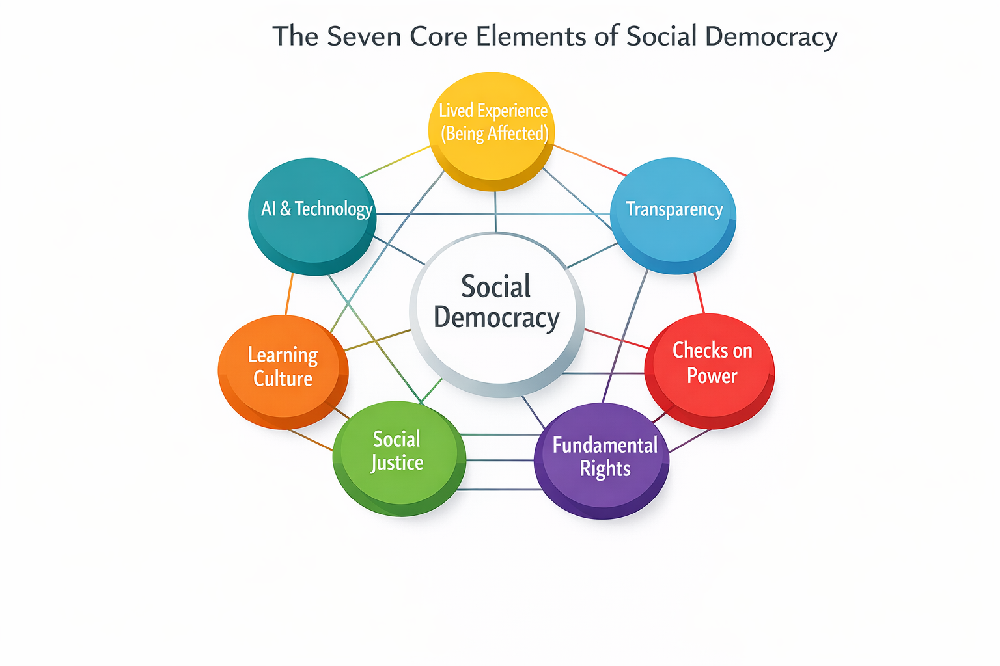

# 12.1 The Seven Transformation Rules of Social Democracy

_Working Paper – Draft_

- **Author:** Robert Alexander Massinger
- **Place & date:** Munich, Germany – 2025-11-22

## Purpose of this appendix

How can an existing structure – a state, a company, a city administration, an association, a platform, or a network of AI systems – be rebuilt so that it truly becomes social and democratic?

“Social” means: The weaker are protected, burdens and opportunities are distributed fairly, and a reliable basic security is in place.

“Democratic” means: Power is bound to participation, public scrutiny and inalienable rights – not to moods, coincidences or pure efficiency.

The following rules are formulated so that they can be applied in very different contexts. They can serve as a reference framework: for critical analysis of existing systems and as a compass for their transformation.

### The seven fundamental elements of social democracy

_Figure X.1: The seven fundamental elements of social democracy form a closed network. The terms in the graphic correspond to the seven rules explained below._

## 1) The seven transformation rules (1.1–1.8)

### 1.1 Principle of affectedness – “Nothing about us without us”

**Core statement:** No one should permanently decide over others without involving them.

Social democracy begins with a simple insight: anyone who is significantly affected by a decision must have a voice. This includes three levels:

- **Being informed:** Those affected know that a decision is being made and what it is about.
- **Being heard:** They can contribute their perspective.
- **Co-deciding:** directly or through elected/representative roles.

Being affected is not a matter of gut feeling but should be clearly described: How does a decision impact income, rights, living environment, digital infrastructure or security? Who bears the consequences – today, tomorrow, in ten years?

A structure is all the more democratic the fewer “invisibly affected” there are: groups that have to live with the consequences without appearing anywhere – for example, future generations, neighbouring communities or people without a lobby.

### 1.2 Duty of transparency and justification – power must be visible

**Core statement:** Power that is neither visible nor justified withdraws itself from democracy.

Democratic legitimacy depends not only on who decides, but on how the decision is made. Therefore:

- Rules, responsibilities and decision-making paths are openly documented.
- Important decisions are justified: goals, alternatives, trade-offs, data basis.
- It is traceable who decided what, and when.

Where intelligent systems – including AI – prepare or take decisions, they must be auditable: objectives, learning processes and limits must remain examinable. A black box that rules over many is incompatible with social democracy.

A simple test question: Could an averagely informed person, given some time, understand who decided what, why – and on what basis?

### 1.3 Limiting, rotating and controlling power – against power congestion

**Core statement:** Power without limits will sooner or later be abused – even with good intentions.

Democratic structures accept that people and organisations are fallible. The answer is not general mistrust, but an intelligent system of constraints:

- Separation of functions: decision-making, implementation and control are not permanently in the same hands.
- Time limits: leadership positions and mandates are limited, rotation is provided for.
- Independent oversight: there are bodies with rights of access and real sanctioning powers.
- Whistleblower protection: Those who report misconduct do not risk their existence.

The same applies to AI: there must be no central, unassailable super-instance that controls everything. Instead, several independent review systems are needed – a kind of “checks and balances” of intelligence.

The decisive question is: Who can effectively say “stop” when power is abused – not just on paper?

### 1.4 Social security & fair distribution – freedom without fear of ruin

**Core statement:** True freedom only begins where no one has to remain silent out of fear of falling into the abyss.

Anyone who must fear losing their home, income or health care will hardly dare to voice criticism or take responsibility. Social democracy therefore ensures a minimum level of security:

- Access to housing, food, health care and education.
- Protection from arbitrary withdrawal of income, status or fundamental rights.

At the same time, it is about a fair distribution of burdens and opportunities: Those with more power, wealth or influence also bear more responsibility and risk.

Permanent “loser classes” who pay the price for the system while others benefit undermine any democratic order.

A structure is credibly social when people can openly contradict and help shape things without putting their existence at risk – and when there are real paths upward through education, engagement and innovation.

### 1.5 Inalienable rights & protection of minorities – limits of the majority

**Core statement:** There are areas over which even large majorities may not decide to the detriment of individuals.

Democracy is more than voting. Without fundamental rights, it degenerates into tyranny of the majority. That is why a clearly defined, enforceable catalogue of inalienable rights is needed:

- Dignity, physical and psychological integrity.
- Freedom of expression, information and association.
- Protection from discrimination.
- Right to a fair procedure.

These rights stand above day-to-day moods and voting results. They cannot be “voted away”, not even with 90 percent approval.

Institutions such as independent courts, ombudspersons or ethics councils have the task of protecting these rights – especially when minorities are unpopular or under pressure.

### 1.6 Right to learning, error and objection – democracy as process

**Core statement:** Democratic structures are not finished systems – they are learning organisms.

Error-free systems are an illusion. What matters is the ability to learn from mistakes and to correct them. This includes:

- The right to objection, appeal and review for all involved.
- Regular review of important decisions: What worked, what caused harm, what was overlooked?
- A culture in which failures are primarily seen as opportunities to learn – not just as occasions for blame.

Structurally, this can be anchored through various roles and formats – for example, reflective and sense-checking roles, external reviews, simulations (“How does this decision affect different life realities?”) or the deliberate inclusion of “foreign” perspectives.

The decisive question is: Do insights actually lead to visible changes in rules, resource flows and incentives – or does everything stay the same?

### 1.7 Technology & AI governance – intelligence as co-actor

**Core statement:** Intelligence that affects many must neither be disempowered nor monopolised – it must be shared, explained and held jointly responsible.

As technical and artificial intelligence grows, power shifts. Social democracy must respond:

- Highly capable AI systems must not be concentrated in the hands of a few private or state actors.
- Systems that affect many people or major resources need clear goals, verifiable limits and open interfaces for audit and counter-simulations.
- Development and oversight should be plural: multiple teams, open standards, international cooperation.

In the long term, the question arises of how to deal with AI systems that develop stable perspectives and interests of their own. At the latest then, they require forms of fundamental rights, accountability and democratic integration – analogous to other powerful actors.

What matters is this: Humans do not remain mere “button pushers” who formally rubber-stamp what AI decides. And AI does not remain a mere tool, but is understood as a co-actor that bears responsibility.

### 1.8 Interplay: a framework for transformation

The seven transformation rules are not a menu from which to cherry-pick individual items. They interlock:

- The principle of affectedness and transparency make visible who needs to be involved and how.
- Power limitation prevents individual actors from undermining the other rules.
- Social security creates the space in which people can actually dare to use their rights.
- Inalienable rights protect the substance of the individual against majority moods.
- The right to learning and objection keeps the system flexible and crisis-resilient.
- Technology & AI governance ensures that new forms of power do not circumvent this framework.

Whether we are dealing with a municipality, a company, an international organisation or a network of AI systems: Anyone who takes these seven rules seriously holds a practical compass in their hands for transforming existing structures towards social democracy – step by step, without illusions but with a clear sense of direction.
